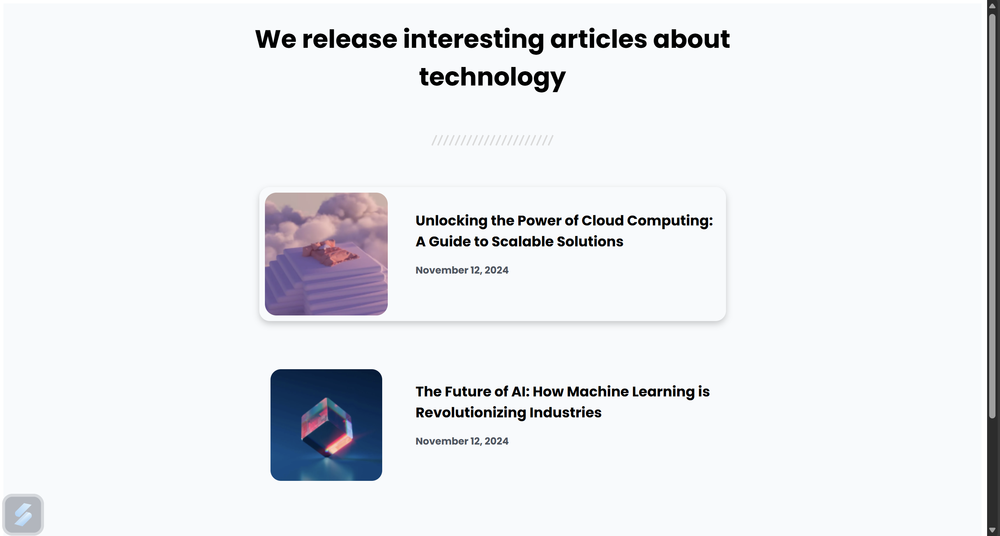

# Simple Article Listing

This is a simple and responsive article listing webpage that showcases a list of articles with a clean, modern design. The page features a smooth hover effect on articles and uses flexbox for layout alignment.

## 🖥️ Features
- **Responsive Design**: Adapts well to various screen sizes.
- **Modern Styling**: Utilizes Google Fonts for typography and CSS transitions for hover effects.
- **Flexbox Layout**: Ensures proper alignment and spacing.
- **Interactive Hover Effects**: Articles lift slightly, and images and text scale for a polished feel.

## 🛠️ Technologies Used
- **HTML5**: Markup structure.
- **CSS3**: Styling and layout.
- **Google Fonts**: Custom fonts for typography (Poppins, Inter, and Sora).

## 🏗️ Project Structure
```
simpleArticleListing/
|
+-- resources          # resources for webpage
+-- index.html         # Main HTML file
+-- styles.css         # CSS file for styling
\-- README.md          # Documentation (this file)
```

## 🚀 How to Use
1. Clone the repository:
   ```bash
   git clone https://github.com//simpleArticleListing.git 
2. Open the `index.html` file in your favorite browser.

## 📂 Folder Structure
- index.html: Contains the HTML structure of the article listing page.
- style.css: Provides the CSS styling, including hover effects and flexbox-based layout.
- resources/: Folder for assets like images and separator graphics.

## 📝 Customization
- Update article details (titles, dates, and images) in the index.html file.
- Adjust colors, font sizes, or layout in the style.css file.

## 🖼️ Screenshot


## 🌟 Features Showcase
1. Hover over an article to see the shadow and lift effect.
2. Hover over the article image for a slight zoom effect.
3. Article title and date scale slightly for an interactive touch.